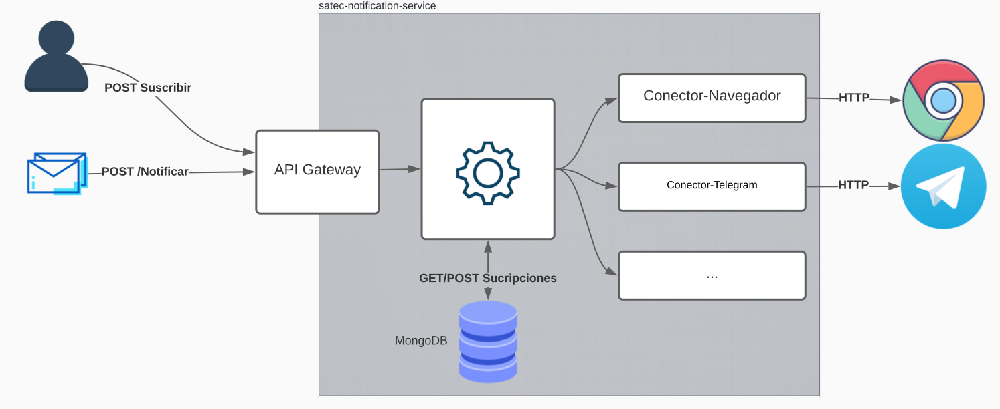

[](https://github.com/UO276213/satec-notification-service/actions/workflows/develop-test.yml)

# satec-notification-service

Servicio que permite registrar usarios para enviarles notificaciones/mensajes a través de múltiples plataformas.



El sistema ofrece una API desarrollada con Django Rest Framework para gestionar las suscripciones, ver plataformas disponibles o añadir aplicaciones que generen notificaciones.

### Plataformas disponibles

El servicio ofrece, actualmente, los siguientes medios para recibir las notificaciones/mensajes.

>- **Navegador web**: Los suscriptores de esta plataforma reciben los mensajes en su navegador web gracias a la tecnología web [Push API](https://developer.mozilla.org/es/docs/Web/API/Push_API).
>- **Slack**: Obtén notificaciones en tu chat de [Slack]("https://slack.com/intl/es-es/") mediante este conector.
>- **Microsoft Teams**: Recibe las notificaciones directamente en [Microsoft Teams]("https://www.microsoft.com/es-es/microsoft-teams/group-chat-software").
>- **Telegram**: Recibe notificaciones en la plataforma de mensajería [Telegram]("https://web.telegram.org/z/").
>- **Email**: Permite enviar mensajes a la bandeja de correo que quieras.


### Rutas de la API

| Endpoint | GET | POST | PUT |DELETE|
| -- | -- | -- | -- | -- |
| `v1/subscriptions` | Listar las suscripciones | Registrar una suscripción | N/A | N/A |
| `v1/subscriptions/id` | N/A | N/A | Actualizar la suscripción | Eliminar suscripción |
| `v1/services` | Listar los servicios | Registrar un nuevo servicio | N/A | N/A
| `v1/services/id` | N/A | N/A | Actualizar servicio | Eliminar servicio
| `v1/conectors` | Muestra los conectores disponibles | N/A | N/A | N/A
| `v1/notifications` | N/A | Enviar mensaje para notificar a los suscriptores | N/A | N/A |

### Instalación

Creamos un directorio e inicilizamos un entorno virtual de python dentro.
Depués, ejecutamos los siguientes comandos
```
git clone https://github.com/manuel-anton-satec/satec-notification-service.git
cd satec-notification-service
cd app
pip install -r requirements.txt
python manage.py migrate
python manage.py createsuperuser
python manage.py manageconectors --add
python manage.py runserver
```

### Recomendaciones 
Python 3.8 o superior. El servicio podría no funcionar para versiones anteriores.